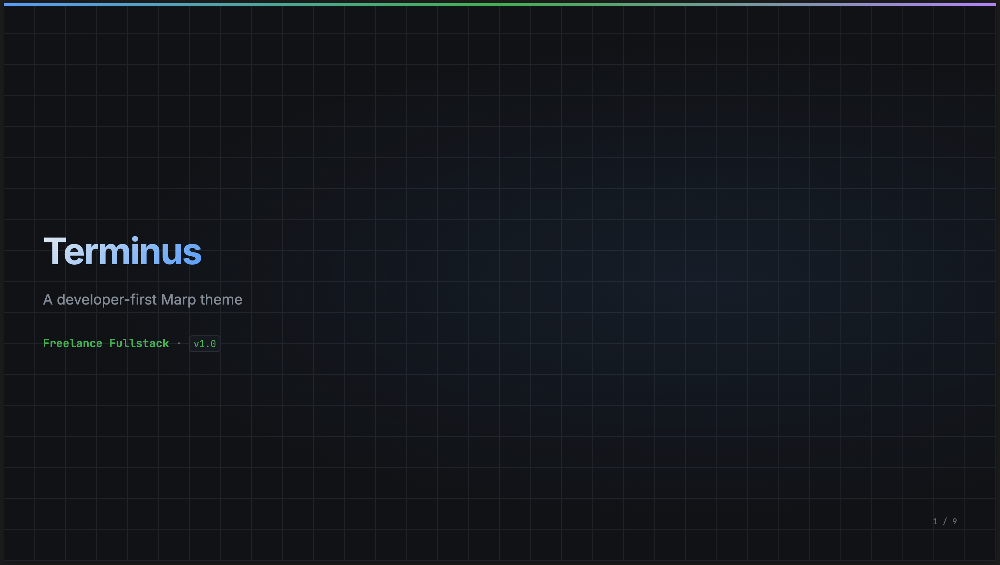
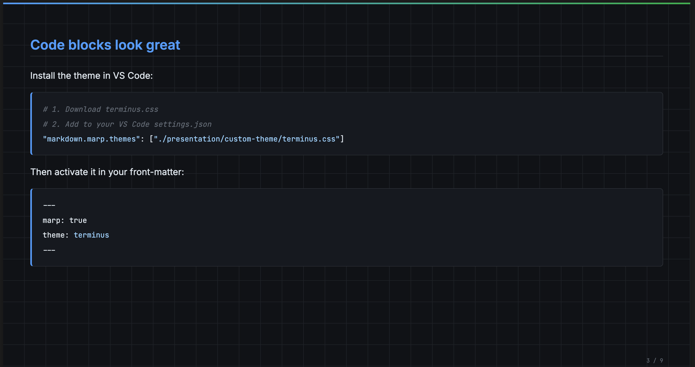
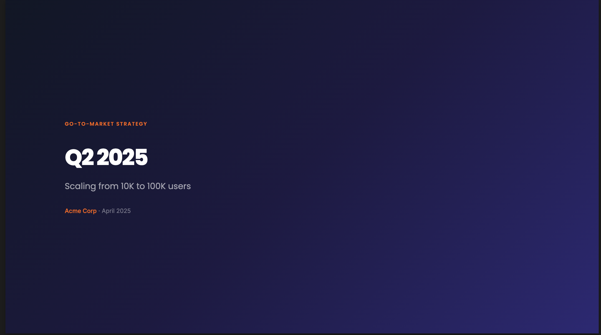
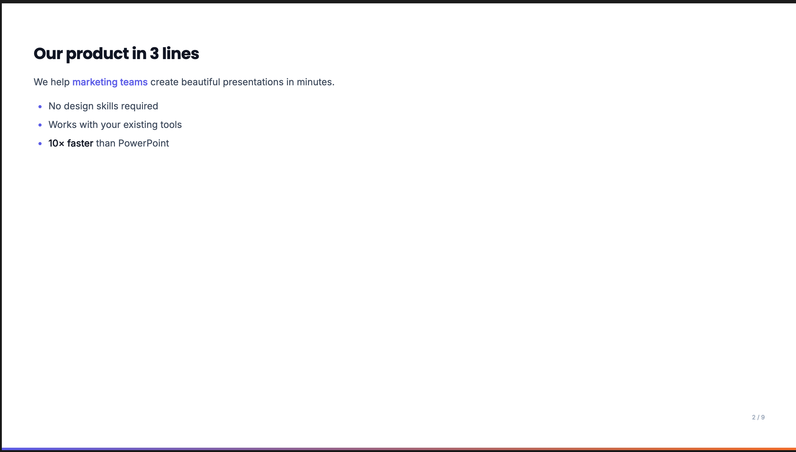

## FR

Ces dossiers contiennent des **thèmes personnalisés pour MARP** (Markdown → slides).
Ils servent aussi d’exemples et d’assets pour illustrer mon article de blog : [MARP : Créer des présentations simples très rapidement](https://www.freelance-fullstack.dev/blog/marp-presentations-simples.html).

## EN

These folders contain **custom MARP themes** (Markdown → slides).
They’re also used as examples/assets to illustrate my blog post: [MARP: Create simple presentations fast](https://www.freelance-fullstack.dev/blog/marp-presentations-simples.html).

## FR — Captures d’écran

Des captures d’exemple sont disponibles dans `screenshots/` (1–2 par thème).

### Terminus

### Pitch

## EN — Screenshots

Example screenshots are available in `screenshots/` (1–2 per theme).

### Terminus

### Pitch

